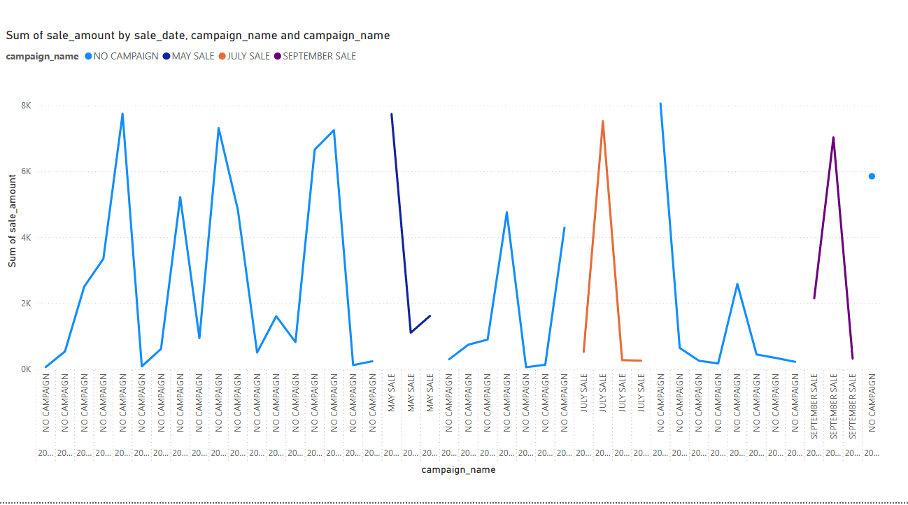
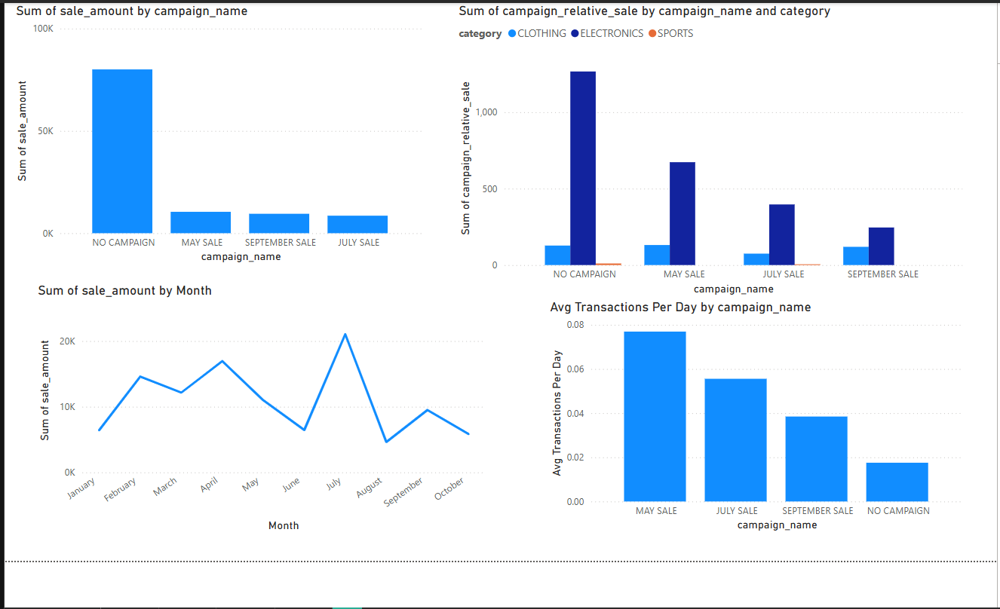

# smart-store-justin
## Virtual Environment Setup Command
```shell  
.venv\Scripts\activate
```
## Git Commands  
```shell  
 git add .
 ```
 ```shell
 git commit -m "Update"
 ```
 ```shell
 git push
 ```
 
## Run a Python Script
```shell  
py scripts\script_name.py
```

## Install Packages From Requirements
```shell  
py -m pip install --upgrade -r requirements.txt
```

## data_prep and data_scrubber
Data prep should clean andn standardize all three data files. It uses almost all funtions in in the data scrubber. I could not get it to replace missing values. Something is deleting all data rows with missing info.

## etl_to_dw 
This creates and loads a local SQL data base with prepared data.

## PowerBI 
This code transforms the customer data table to a table that has the top customers listed from the most spent to the least.
```shell
let
    Source = Odbc.Query("dsn=SmartSalesDSN", "SELECT c.name, SUM(s.sale_amount) AS total_spent
FROM sale s
JOIN customer c ON s.customer_id = c.customer_id
GROUP BY c.name
ORDER BY total_spent DESC;")
in
    Source
```  
Here is my schema.  
  
This is the transfomed customer table  
  
Here are the interactive visuals created  
  
  
## Transfomration and Visualization  
Added a campaign table. Cubed in python with pandas and created one chart and then switched to PowerBI.  
Heres the power query code for transforming my sales table.  
```shell
let
    Source = Odbc.DataSource("dsn=SmartSalesDSN", [HierarchicalNavigation=true]),
    sale_Table = Source{[Name="sale",Kind="Table"]}[Data],
    #"Inserted Parsed Date" = Table.AddColumn(sale_Table, "Parse", each Date.From(DateTimeZone.From([sale_date])), type date),
    #"Inserted Year" = Table.AddColumn(#"Inserted Parsed Date", "Year", each Date.Year([Parse]), Int64.Type),
    #"Inserted Quarter" = Table.AddColumn(#"Inserted Year", "Quarter", each Date.QuarterOfYear([Parse]), Int64.Type),
    #"Inserted Month" = Table.AddColumn(#"Inserted Quarter", "Month", each Date.Month([Parse]), Int64.Type),
    #"Removed Columns" = Table.RemoveColumns(#"Inserted Month",{"Month"}),
    #"Inserted Month Name" = Table.AddColumn(#"Removed Columns", "Month Name", each Date.MonthName([Parse]), type text),
    #"Expanded campaign" = Table.ExpandRecordColumn(#"Inserted Month Name", "campaign", {"start_date", "end_date"}, {"start_date", "end_date"}),
    #"Parsed Date" = Table.TransformColumns(#"Expanded campaign",{{"end_date", each Date.From(DateTimeZone.From(_)), type date}, {"start_date", each Date.From(DateTimeZone.From(_)), type date}}),
    #"Added Conditional Column" = Table.AddColumn(#"Parsed Date", "Custom", each if [campaign_id] = 0 then List.Max(#"Parsed Date"[Parse]) - List.Min(#"Parsed Date"[Parse]) else [end_date]-[start_date]),
    #"Grouped Rows" = Table.Group(#"Added Conditional Column", {"campaign_id"}, {{"getit", each List.Average([Custom]), type duration}}),
    #"Added Custom2" = Table.AddColumn(#"Added Conditional Column", "Custom2", each if [campaign_id] = 0 then List.Sum(#"Grouped Rows"[getit]) - [Custom] else [Custom]),
    #"Removed Columns1" = Table.RemoveColumns(#"Added Custom2",{"Custom"}),
    #"Renamed Columns" = Table.RenameColumns(#"Removed Columns1",{{"Custom2", "campaign_length"}}),
    #"Changed Type" = Table.TransformColumnTypes(#"Renamed Columns",{{"campaign_length", Int64.Type}}),
    #"Added Custom" = Table.AddColumn(#"Changed Type", "campaign_relative_sale", each [sale_amount]/[campaign_length]),
    #"Changed Type1" = Table.TransformColumnTypes(#"Added Custom",{{"campaign_relative_sale", type number}})
in
    #"Changed Type1"
```  
Here are images of the power of the visualsations I made  
  
  