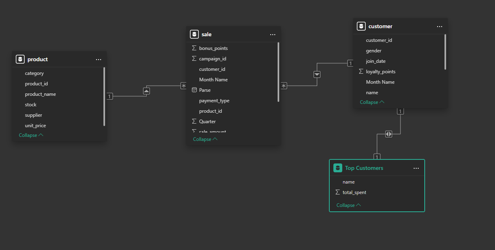
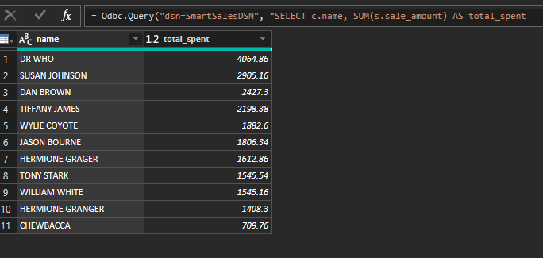
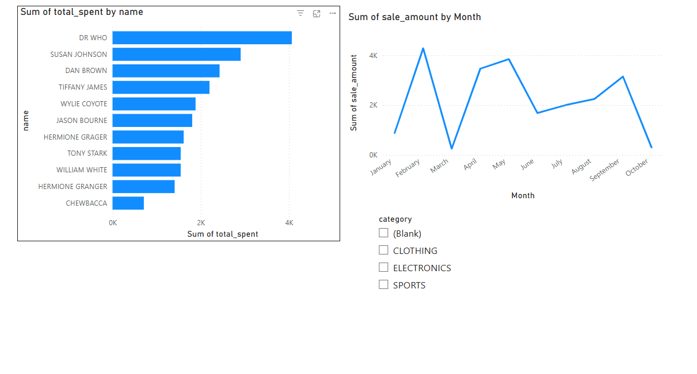
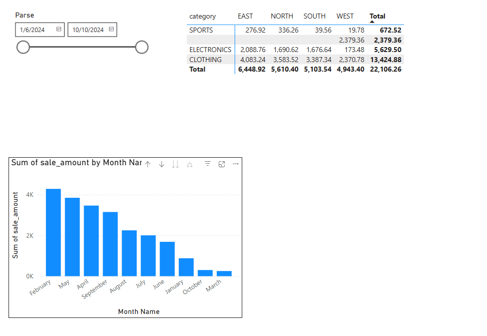

# smart-store-justin
## Virtual Environment Setup Command
```shell  
.venv\Scripts\activate
```
## Git Commands  
```shell  
 git add .
 ```
 ```shell
 git commit -m "Update"
 ```
 ```shell
 git push
 ```
 
## Run a Python Script
```shell  
py scripts\script_name.py
```

## Install Packages From Requirements
```shell  
py -m pip install --upgrade -r requirements.txt
```

## data_prep and data_scrubber
Data prep should clean andn standardize all three data files. It uses almost all funtions in in the data scrubber. I could not get it to replace missing values. Something is deleting all data rows with missing info.

## etl_to_dw 
This creates and loads a local SQL data base with prepared data.

## PowerBI 
This code transforms the customer data table to a table that has the top customers listed from the most spent to the least.
```shell
let
    Source = Odbc.Query("dsn=SmartSalesDSN", "SELECT c.name, SUM(s.sale_amount) AS total_spent
FROM sale s
JOIN customer c ON s.customer_id = c.customer_id
GROUP BY c.name
ORDER BY total_spent DESC;")
in
    Source
```  
Here is my schema.  
  
This is the transfomed customer table  
  
Here are the interactive visuals created  
  
  
